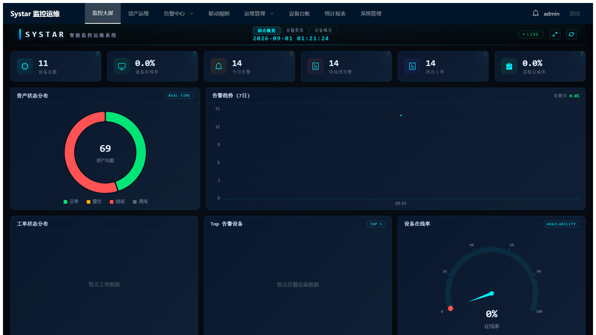
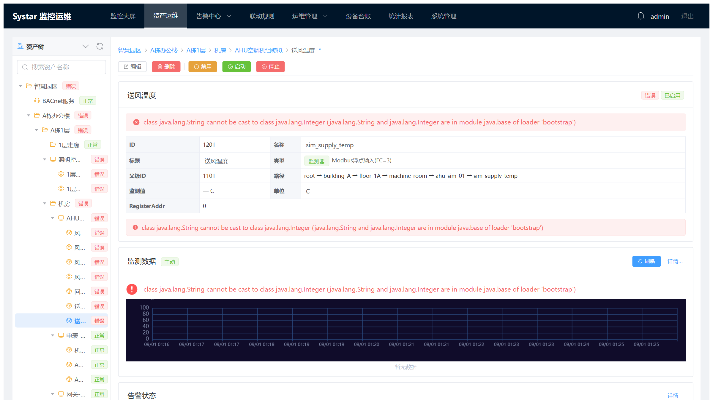
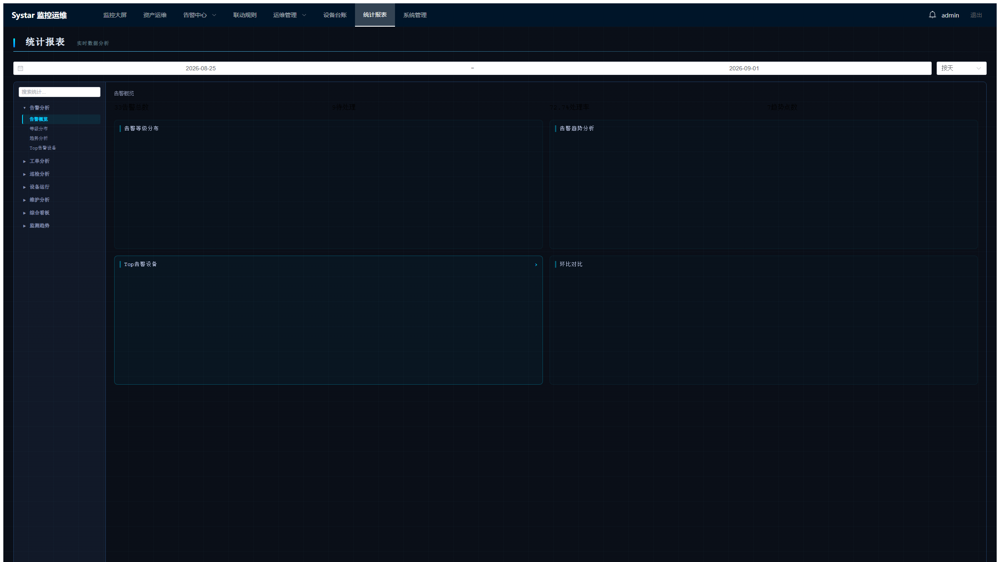

# Systar — 工业物联网监控运维平台

[English](README.md) | 简体中文

> **项目状态**：v1.1.0，持续开发中。端到端链路（采集 → 存储 → 告警 → 联动 → 控制 →
> 统计 → 运维 → 看板）已完成，并有自动化测试覆盖。

Systar 是一个通用 IoT 工业监控运维框架，适用于智慧园区、工厂产线、能源管理、数据中心等
场景。核心监控引擎与 Web 层解耦，可作为独立库嵌入。

## 系统截图

以下截图均为内置模拟器生成的演示数据（H2 开发模式）——按照
[快速开始](#快速开始) 启动后看到的就是同样的画面。

**监控大屏** —— KPI 总览、设备状态分布、实时告警与实时趋势：



**资产运维** —— 层级资产树、监测点详情面板与交互式趋势图（平移 / 缩放 /
自动粒度切换）：



**统计报表** —— 告警趋势、类型分布与处理率 KPI：



## 核心特性

- **资产层级建模** — 空间（Space）→ 设备（Device）→ 服务（Service）→
  监测点（Probe）/ 控制点（Control）的树形结构
- **多协议数据采集** — 14 种协议驱动：Modbus TCP、OPC UA、BACnet/IP、SNMP、Siemens S7、
  IEC 60870-5-104、MQTT、WebSocket、原始 TCP/IP、UPS（SNMP）、天气（HTTP API）、
  环境传感器（被动 TCP）、内置模拟器、手动输入——支持主动轮询与被动接收两种模式
- **虚拟监测点** — 基于 SpEL 表达式的派生指标引擎，支持跨监测点计算、依赖跟踪与循环检测
- **告警引擎** — 三种策略（单次/持续/选择性）、多级告警、自动恢复检测，附告警关联与抑制
- **联动引擎** — 因 → 果自动化规则，可由监测值或告警触发
- **定时控制** — Cron 表达式驱动的计划任务，前端提供可视化 Cron 向导
- **实时推送** — WebSocket 推送监测值变化与告警消息
- **REST API** — 资产 CRUD、实时/历史数据、控制执行、告警/联动/定时任务管理、看板聚合
- **运维套件** — 工单系统、设备台账、巡检管理、统计报表、异常检测与健康评估
- **数据看板** — 基于 ECharts 的 KPI 大屏（资产状态、在线率、告警趋势）
- **数据保留策略** — 按配置天数自动清理过期数据
- **跨数据库** — MySQL（生产）与 H2（开发/测试）通过方言适配器切换

## 架构

```
core/                          监控框架（可独立使用）
├── systar-common/             通用工具（ID 生成、代码字典、系统配置、TimeSpan）
├── systar-monitor-core/       核心监控引擎（资产模型、调度、结果分发、
│                              告警、联动、虚拟监测点）
├── systar-data/               数据访问层（MyBatis-Plus 实体/映射器、仓储实现）
└── systar-monitor-drivers/    协议驱动集合（14 个实现）
extensions/
├── systar-server/             Spring Boot 启动入口、REST API、配置、生命周期管理
├── systar-websocket/          实时推送（监测值 + 告警消息）
├── systar-ops/                运维业务（工单、设备台账、巡检、统计分析）
└── systar-system/             系统管理（用户、角色、菜单、部门、通知、日志）
simulator/                     合成数据发生器（随机/正弦/斜坡/相关数据模板），
                               用于演示与压力测试
frontend/                      Vue 3 单页应用
sql/                           MySQL + H2 双方言脚本与种子数据
```

模块依赖关系：

```
systar-server ──→ systar-websocket ──→ systar-monitor-core ──→ systar-common
systar-server ──→ systar-data ────────→ systar-monitor-core
systar-server ──→ systar-monitor-drivers → systar-monitor-core
systar-server ──→ systar-ops ──→ systar-data, systar-common
systar-server ──→ systar-system ──→ systar-data, systar-common
```

## 技术栈

| 组件 | 版本 | 用途 |
|------|------|------|
| Java | 17 LTS | 运行时 |
| Spring Boot | 3.3.6 | 应用框架 |
| MyBatis-Plus | 3.5.7 | ORM |
| MySQL | 8.x | 生产数据库 |
| H2 | 2.3.232 | 开发/测试数据库 |
| Vue | 3.4 | 前端框架 |
| Element Plus | 2.5 | UI 组件库 |
| ECharts | 5.5 | 图表可视化 |
| Pinia | 2.1 | 状态管理 |
| Vite | 5.4 | 前端构建 |
| Hutool | 5.8.27 | 工具库 |

构建工具：Maven（多模块，自带 Wrapper，无需本地安装 Maven）。

## 快速开始

### 环境要求

- JDK 17+
- Node.js 18+（仅前端开发需要）
- MySQL 8.x（仅生产模式需要——dev profile 使用内嵌 H2，零配置）

### 运行后端（端口 8081）

```bash
# H2 开发模式——自动加载 schema 与种子数据
./mvnw spring-boot:run -pl extensions/systar-server -Dspring-boot.run.profiles=dev

# MySQL 生产模式
./mvnw clean package -pl extensions/systar-server -am -DskipTests
java -jar extensions/systar-server/target/systar-server-1.1.0.jar
```

API 基础路径：`http://localhost:8081/api/monitor` · WebSocket：`ws://localhost:8081/ws/monitor`

MySQL 部署请先初始化数据库（仅首次）：

```bash
bash sql/mysql/init.sh      # Linux / macOS
sql\mysql\init.bat          # Windows
```

### 运行前端（端口 5173）

```bash
cd frontend
npm install
npm run dev
```

开发服务器将 API 请求代理到 `http://localhost:8081`。

### 辅助脚本

`bin/` 提供 Windows（`.bat`）与 Linux/macOS（`.sh`）的启停/构建/数据库初始化脚本，
含一键 `start-all` / `stop-all`。

## 配置

`extensions/systar-server/src/main/resources/application.yml` 中的关键配置：

| 环境变量 | 用途 | 默认值 |
|----------|------|--------|
| `SYSTAR_SECRET` | JWT 签名密钥 | `changeme-default-secret` |
| `SYSTAR_DB_PASSWORD` | MySQL 口令（两个数据源共用） | `123456` |

其他重要配置项：`systar.database.type`（`mysql` \| `h2`）、`systar.security.whitelist`
（免认证路径白名单）、独立统计数据源（`systar.stats-datasource.*`）。

> **安全提示**
> - 种子数据库内置 `admin` / `admin123` 账号——对外暴露服务前必须修改。
> - 生产环境务必覆盖 `SYSTAR_SECRET`；默认值绝不可离开本地开发机。

## 测试

```bash
./mvnw clean test -o      # 后端全量回归（离线模式）
cd frontend && npm test   # 前端单元测试
```

## REST API 概览

| 方法 | 路径 | 说明 |
|------|------|------|
| GET | `/api/monitor/tree` | 获取完整资产树 |
| GET/POST/PUT/DELETE | `/api/monitor/assets` | 资产 CRUD |
| PUT | `/api/monitor/assets/{id}/start\|stop\|enable\|disable` | 运行时启停控制 |
| GET | `/api/monitor/probe-values` | 获取监测点实时值 |
| GET | `/api/monitor/probe-history` | 查询历史数据（分页） |
| POST | `/api/monitor/control/{id}/execute` | 执行控制命令 |
| GET/POST/PUT/DELETE | `/api/monitor/alarm-rules` | 告警规则管理 |
| GET | `/api/monitor/alarm-messages` | 获取告警消息（分页） |
| GET/POST/PUT/DELETE | `/api/monitor/correlation-rules` | 告警关联规则 |
| GET/POST/PUT/DELETE | `/api/monitor/escalation-policies` | 告警升级策略 |
| GET/POST/PUT/DELETE | `/api/monitor/linkage-rules` | 联动规则 CRUD |
| GET/POST/PUT/DELETE | `/api/monitor/scheduled-tasks` | 定时任务 CRUD |
| GET | `/api/monitor/dashboard` | 数据看板聚合 |
| POST | `/api/auth/login` | 用户登录 |
| GET/POST/PUT/DELETE | `/api/ops/work-orders` | 工单管理 |
| GET/POST/PUT/DELETE | `/api/ops/device-ledger` | 设备台账 |
| GET/POST/PUT/DELETE | `/api/ops/inspection` | 巡检管理 |
| GET/POST/PUT/DELETE | `/api/ops/statistics` | 统计报表 |
| GET | `/api/ops/trend` | 趋势图数据（自适应粒度） |
| GET | `/api/ops/analysis` | 异常检测与健康评估 |
| GET/POST/PUT/DELETE | `/api/sys/user` | 用户管理 |
| GET/POST/PUT/DELETE | `/api/sys/role` | 角色管理 |
| GET/POST/PUT/DELETE | `/api/sys/menu` | 菜单管理 |
| GET/POST/PUT/DELETE | `/api/sys/dept` | 部门管理 |
| GET/PUT | `/api/sys/notice` | 通知公告 |
| GET | `/api/sys/log` | 操作日志 |
| GET/PUT | `/api/sys/data-retention` | 数据保留策略 |

## 项目目录

```
systar/
├── core/                        监控核心模块（见"架构"）
├── extensions/                  服务与业务模块（见"架构"）
├── simulator/                   合成数据发生器
├── frontend/                    Vue 3 应用（views / components / composables / api）
├── sql/
│   ├── h2/{ddl,data}/           H2 schema + 种子数据
│   └── mysql/{ddl,data}/        MySQL schema + 种子数据，附 init.sh / init.bat
├── bin/                         启停/构建/初始化脚本（Windows + Linux/macOS）
├── lib/maven-repo/              离线构建用 vendored Maven 产物
│                                （BACnet4J 及其依赖——见 THIRD-PARTY-NOTICES.md）
├── docs/                        文档
└── temp/                        运行时临时文件（PID、日志）
```

## 文档索引

| 文档 | 路径 |
|------|------|
| 开发路线图 | [docs/roadmap.md](docs/roadmap.md) |
| 技术概览 | [docs/tech_overview.md](docs/tech_overview.md) |
| 功能需求 | [docs/requirements.md](docs/requirements.md) |
| 概要设计 | [docs/design/architecture.md](docs/design/architecture.md) |
| 资产 CRUD 设计 | [docs/design/asset-crud-design.md](docs/design/asset-crud-design.md) |
| 统计管道设计 | [docs/design/stats-pipeline-design.md](docs/design/stats-pipeline-design.md) |
| 虚拟监测点设计 | [docs/design/virtual-probe-design.md](docs/design/virtual-probe-design.md) |
| XML 资产类型配置 | [docs/design/xml-asset-type-config-design.md](docs/design/xml-asset-type-config-design.md) |
| Nginx 部署模板 | [docs/deployment/nginx-systar.conf](docs/deployment/nginx-systar.conf) |
| 前端交互测试清单 | [docs/test/](docs/test/) |

## 开发约定

- 遵循 **SOLID** 设计原则；在满足需求的前提下保持实现尽可能简洁
- **测试驱动开发**；单元测试覆盖率目标 > 90%
- 每次修改都从架构全局审视，而非只解决局部表象
- 防御式编程，侧重输入数据缺漏处理
- 数据库结构变更必须**同时**提供 MySQL 与 H2 两套脚本，保持同步
- Java 17，遵循 Java 官方风格指南；标识符使用英文

工作流细节见 [CONTRIBUTING.zh-CN.md](CONTRIBUTING.zh-CN.md)。

## 参与贡献

欢迎贡献——见 [CONTRIBUTING.zh-CN.md](CONTRIBUTING.zh-CN.md)
（[English](CONTRIBUTING.md)）。

## 许可证

Copyright (C) 2026 Hao Yufei。

Systar 以 **GNU General Public License v3.0 only** 许可发布——见
[LICENSE](LICENSE)。`lib/maven-repo/` 下的 BACnet4J 4.1.6 产物同样为 GPL-3.0
（上游双许可）。完整组件归因见
[THIRD-PARTY-NOTICES.md](THIRD-PARTY-NOTICES.md)。
